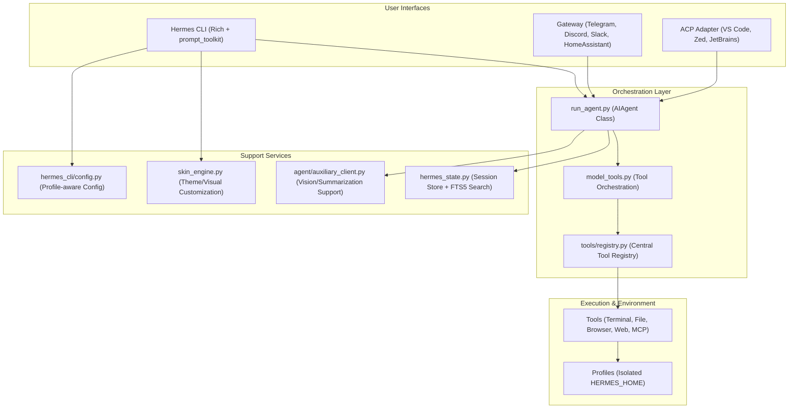

# Hermes-Agent: Comprehensive Architecture & USP Review

This document provides a detailed architectural review of the Hermes-Agent project, highlighting its core features and unique selling points (USPs) that set it apart from typical autonomous agents.

## 1. System Architecture

Hermes-Agent is designed as a modular, profile-aware, and multi-interface agent system. It decouples the core logic from the user interface and the execution environment.

## 2. Core Features

### A. Modular Tooling & Discovery
Tools are registered at import time via a central registry. This allows for:
- **Environment Isolation**: Tools check their own requirements (API keys, binaries) before becoming available.
- **Parallel Dispatch**: Support for parallel tool execution in the agent loop.
- **Standardized Schemas**: One central place for tool definitions, used by CLI, Gateway, and IDEs.

### B. Persistent Session Management
- **SQLite + FTS5**: Uses SQLite with Full-Text Search (FTS5) for fast conversation retrieval.
- **Trajectory Persistence**: Saves full agent trajectories (reasoning + tools + results) for debugging and RL training.

### C. Multi-Interface Accessibility
- **Advanced CLI**: Built with `Rich` and `prompt_toolkit`, featuring a theme/skin engine.
- **Unified Gateway**: A single platform to bridge the agent to Telegram, Slack, Discord, and even Home Assistant.
- **IDE Integration**: Implements an ACP (Agentic Control Protocol) adapter for seamless use within professional editors.

### D. Advanced Browser & Terminal Support
- **Terminal Backends**: Supports local, Docker, SSH, Modal, and Daytona environments.
- **Browserbase Integration**: Full browser automation for complex web tasks.

## 3. Unique Selling Points (USPs)

The following features represent the "secret sauce" of Hermes-Agent that can be adopted by other agentic systems.

| USP | Description | Value Proposition |
| :--- | :--- | :--- |
| **Profile Isolation (`HERMES_HOME`)** | Every instance (profile) has its own isolated home directory for config, keys, memory, and sessions. | Allows managing multiple "agent personas" or environments on one machine without collision. |
| **Data-Driven Skin Engine** | The entire visual experience (colors, emojis, spinner animations, branding) is defined via YAML/Dict data. | Decouples UX design from core logic; enables "Premium" branding without code changes. |
| **Prompt Caching Discipline** | Architectural guarantee that past context is never modified mid-conversation to preserve Anthropic/OpenAI caching. | Drastically reduces costs (up to 90%) and latency for long-running autonomous tasks. |
| **Unified Command Registry** | Slash commands (like `/reset`, `/model`, `/skin`) are defined once and inherited by CLI, Gateway, and Autocomplete. | Single source of truth for interaction logic across all interfaces. |
| **Kawaii UX Philosophy** | Uses "KawaiiSpinners" (animated faces) and specific verbs/wings to indicate agent states (thinking, waiting). | High "user delight" factor; makes the agent feel "alive" and interactive rather than a dry CLI. |
| **Auxiliary LLM Client** | Offloads non-critical tasks like image summarization or context compression to cheaper/faster models. | Balances performance and cost by reserving the expensive primary model for reasoning. |
| **Session FTS5 Search** | Integrated full-text search across all historical sessions. | Transforms the agent from a one-off tool into a searchable personal knowledge base. |
| **Smart Model Routing** | Dynamically routes specific tasks (like summarization or vision) to specialized models. | Optimizes efficiency and ensures the best tool is used for each sub-problem. |
| **Credential Pooling** | Manages a pool of API keys and credentials across different providers. | Enhances reliability and allows for easier rotation and multi-tenancy. |
| **Real-time Cost Tracking** | Built-in token-level pricing and budget management for every session. | Prevents "bill shock" and allows for precise ROI measurement of agentic tasks. |
| **Integrated Redaction** | Automatically identifies and redacts sensitive information (keys, passwords) from logs/display. | Essential for enterprise security and safe sharing of trajectories. |
| **Context Compression** | Intelligent compression of historical message context to fit within model limits while preserving key info. | Enables extremely long conversations without losing the "thread" of the task. |

## 4. Key Takeaways for Other Agents

1. **Isolation is Mandatory**: Building on `HERMES_HOME` instead of `~/.app` allows for scalability and multi-tenancy.
2. **UX Matters in Terminals**: A themeable, animated CLI UI significantly improves the developer experience.
3. **Cache or Bust**: Prompt caching is no longer optional; architectural decisions (like toolset stability) must prioritize it.
4. **Interface Neutrality**: Write slash commands and tool handlers once; expose them everywhere.
